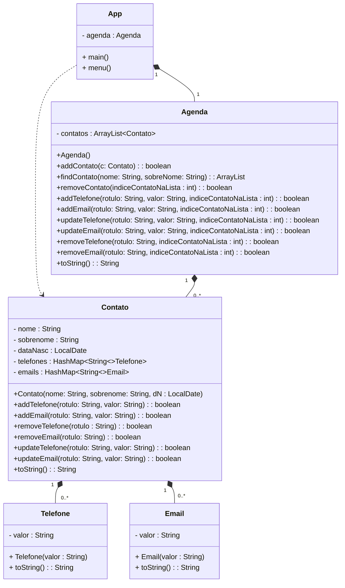

```mermaid
    classDiagram
    

    class Telefone{
        - valor : String
        + Telefone(valor : String)
        + toString() : String
    }

    class Email{
        - valor : String
        + Email(valor : String)
        + toString() : String
    }

    class Contato{
        - nome : String
        - sobrenome : String
        - dataNasc : LocalDate
        - telefones : HashMap~String~~Telefone~
        - emails : HashMap~String~~Email~
        +Contato(nome: String, sobrenome: String, dN : LocalDate)
        +addTelefone(rotulo: String, valor: String): boolean
        +addEmail(rotulo: String, valor: String): boolean
        +removeTelefone(rotulo : String): boolean
        +removeEmail(rotulo: String): boolean
        +updateTelefone(rotulo: String, valor: String): boolean
        +updateEmail(rotulo: String, valor: String): boolean
        +toString(): String
    }

    class Agenda{
        - contatos : ArrayList~Contato~
        +Agenda()
        +addContato(c: Contato): boolean
        +findContato(nome: String, sobreNome: String): ArrayList<Contato>
        +removeContato(indiceContatoNaLista : int): boolean
        +addTelefone(rotulo: String, valor: String, indiceContatoNaLista : int): boolean
        +addEmail(rotulo: String, valor: String, indiceContatoNaLista : int): boolean
        +updateTelefone(rotulo: String, valor: String, indiceContatoNaLista : int): boolean
        +updateEmail(rotulo: String, valor: String, indiceContatoNaLista : int): boolean
        +removeTelefone(rotulo: String, indiceContatoNaLista : int): boolean
        +removeEmail(rotulo: String, indiceContatoNaLista : int): boolean
        +toString(): String
    }

    class App{
        - agenda : Agenda
        + main()
        + menu()
    }

    App ..> Contato
    App "1" *-- "1" Agenda
    Agenda "1" *-- "0..*" Contato
    Contato "1" *-- "0..*" Telefone
    Contato "1" *-- "0..*" Email
```